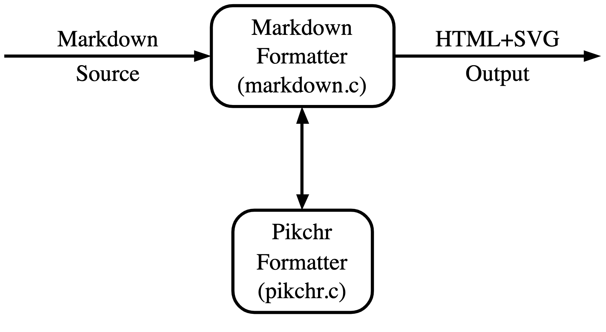

# pikchr

This is extenstion helper for debaging pikchr diagrams.

**Render server.**
You can use a shared server for rendering (set by default in settings in the vscode-extention https://pikchr-render-server.herokuapp.com/) or deploy your server
<a href="https://heroku.com/deploy?template=https://github.com/gebv/pikchr/tree/master">
	
</a>

[Redner server API docs](https://github.com/gebv/pikchr/tree/master/renderserver#pikchr-render-server)

If you have questions, comments, or suggestions, please visit the [GitHub Discussion board](https://github.com/gebv/pikchr/discussions).

## What is pikchr?

> Pikchr (pronounced "picture") is a PIC-like markup language for diagrams in technical documentation. Pikchr is designed to be embedded in fenced code blocks of Markdown or similar mechanisms of other documentation markup languages.
>
> For example, the diagram:
>
> 
>
> [Link to orig SVG](media/demo.png)
>
> Is generated by 7 lines of Markdown:
>
>   ``` pikchr
>   arrow right 200% "Markdown" "Source"
>   box rad 10px "Markdown" "Formatter" "(markdown.c)" fit
>   arrow right 200% "HTML+SVG" "Output"
>   arrow <-> down 70% from last box.s
>   box same "Pikchr" "Formatter" "(pikchr.c)" fit
>   ```

[More deatils on the official website](https://pikchr.org/home/doc/trunk/homepage.md)

## How use?

* select in your active editor the source code of the diagram
* in context menu click to `Preview pikchr diagrаms`
* if selected code is valid will be opened split panel with diagram
* if selected code is invalid - you will be notified about it


